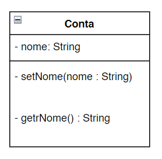

# Diagrams de classe UML de Conta com uma variavel de isntância e os metodos set e get.

Utilizaremos com frequência os diagramas de classe UML para resumir os atributos e operações de uma classe. Na induústria diagramas UML ajudam projetistas de sistemas a especificar um sistema de maneira gráfica, concisa e independente de linguagem de programação antes de os programadores implementarem o sistema em uma linguagem específica  apresenta um diagrama de clase UML para conta 

Compartimento superior

-> Na UML cada classe é modelada em umdiagrama de classe como um retângulo com três compartimentos. Nesse diagrama, o compartimento superior contém o nome da classe Conta centralizado horizontalmente. 

Compartimento intermediário

-> O compartimento intermediário contém o atributo nome da classe, que corresponde à variável de intância de mesmo nome em java. Avariável de instância nome é private em java, assim o diagrama UML de classe lista um modificador de acesso com um sinal (-) antes do nome do atributo. Depois do nome do atributo há um dois pontos (:) e o tipo do atributo, nesse caso String.

Compartimento inferior

-> O compartimento inferior contém as operações da classe, setNome e getNome, que correspondem aos métodos com os mesmos nomes em java. O UML modela as operações listando o nome de cada uma precedido por um modificador de acesso, nesse caso +getNome. Esse sinal (+) indica que gatNome é uma operação pública na UML (porque é um método public em java) A operação getNome não tem nenhum parâmetro, então os parênteses após o nome dela no diagrama de classe estão vazios assim como na declaração de método. A operação setNome, também de caráter público, tem um parâmetro String chamado nome.

Tipos de retorno 

A UML indica o tipo de retorno inserindo 2 pontos (:) e o tipo de retorno após os parenteses que vem depois do nome da operação.