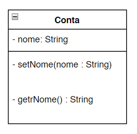

# Diagrams de classe UML de Conta com uma variavel de isntância e os metodos set e get.

Utilizaremos com frequência os diagramas de classe UML para resumir os atributos e operações de uma classe. Na induústria diagramas UML ajudam projetistas de sistemas a especificar um sistema de maneira gráfica, concisa e independente de linguagem de programação antes de os programadores implementarem o sistema em uma linguagem específica  apresenta um diagrama de clase UML para conta 

Compartimento superior

-> Na UML cada classe é modelada em umdiagrama de classe como um retângulo com três compartimentos. Nesse diagrama, o compartimento superior contém o nome da classe Conta centralizado horizontalmente. 

Compartimento intermediário

-> O compartimento intermediário contém o atributo nome da classe, que corresponde à variável de intância de mesmo nome em java. Avariável de instância nome é private em java, assim o diagrama UML de classe lista um modificador de acesso com um sinal (-) antes do nome do atributo. Depois do nome do atributo há um dois pontos (:) e o tipo do atributo, nesse caso String.

Compartimento inferior

-> O compartimento inferior contém as operações da classe, setNome e getNome, que correspondem aos métodos com os mesmos nomes em java. O UML modela as operações listando o nome de cada uma precedido por um modificador de acesso, nesse caso +getNome. Esse sinal (+) indica que gatNome é uma operação pública na UML (porque é um método public em java) A operação getNome não tem nenhum parâmetro, então os parênteses após o nome dela no diagrama de classe estão vazios assim como na declaração de método. A operação setNome, também de caráter público, tem um parâmetro String chamado nome.

Tipos de retorno 

A UML indica o tipo de retorno inserindo 2 pontos (:) e o tipo de retorno após os parenteses que vem depois do nome da operação.

Parâmetros

A UML modela parâmetros de um modo pouco diferente do java listando o nome desse parâmetro, seguido por dois-pontos e pelo tipo dele nos parênteses que seguem o nome da operação. O UML tem seus próprios tipos de dados semelhantes àqueles do java, mas para simplificar, usaremos os tipo s de dado java. O método setNome() de Conta tem um parâmetro String chamado nome.

Engenharia de software com variáveis de instância private e métodos set e get public

como veremos, usando os métodos ser e get, você pode validar tentativas de modificações nos dados private e controlar como os dados são apresentados para o chamador - esses são beneficios convincentes da engenharia de software.

Se a variável de instância fosse public, qualquer cliente da classe - isso é, qualquer outra classe que chama os métodos de calsse -  poderia ver os dados e fazer o que quisesse com eles, inclusive configurá-los como um valor inválido. 

Embora um cliente da classe não possa acessar diretamente uma variável de instância private, ele pode faze o que quiser com a variável por meio dos métodos ser e get public. Você talvez ache que é possível espiar os dados private a qualquer momento com o método get public e também modificá-los à vontade com o por meio do método set public. Mas os métodos ser podem ser programados para validar seus argumentos e rejeitar qualquer tentativa de definir os dados como valores ruins, como temperatura corporal negariva, um dia em março fora do intervalo de 1 à 31, um código de produte que não está no catálogo da empresa etc. E um método get pode apresentar dados de uma forma diferente. Por exemplo, uma classe Grade pode armazenar uma nota como um int entre 0 e 100, mas um método getGrade() pode reornar uma classificação como uma String, por exemplo "A" para as notas entre 90 e 100, "B" para as notas entre 80 e 89 etc. Controlar de perto o acesso e a apresentação dos dados private pode reduzir significativamente os erros, além de aumentar a robustez e a segurança dos seus programas. 

A declaração de variáveis de instância com o modificador de acesso private é conhecida como ocultamento de dados ou ocultamento de informações. Quando um programa cira (instância) um objeto de classe Conta, a variável nome é encapsulada (ocultada) no objeto e pode ser acessada apenas por métodos da classe do objeto. 

Observação de engenharia de software:  → Anteceda cada variável de instância e declaração de método com um modificador de acesso. Geralmente, as variáveis de instância devesm ser declaradas private e os métodos, public. Mais adiante no livro, discutiremos por que você pode querer declarar um método private.

Tipos primitivos vs tipos por referência

